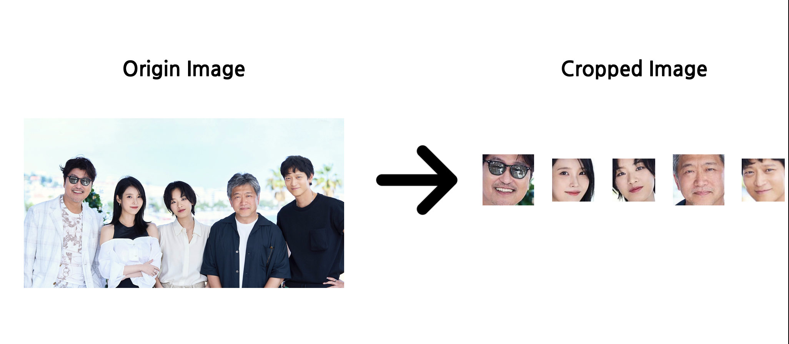

# face-cropper

## Introduction
Crop faces from your image using dlib!!

## Requirements
```
conda install -c conda-forge dlib
conda install -c anaconda pillow
```
## Usage 
```
python face_cropper.py [input PATH of image] [output PATH to save cropped image]
```

**[Example]**
```
python face_cropper.py ./image/input/ ./image/output/
```